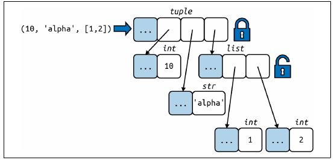

# Understanding Lists and Tuples in Python from a Machine's Perspective

In Python, **lists** and **tuples** are two of the most commonly used data structures for storing ordered collections of elements. While they may seem quite similar in usage —both can hold multiple items of any type— they differ significantly in terms of memory efficiency, performance, and how they are implemented at a low level. 

To truly understand why one might choose to use a tuple over a list, or vice versa, it’s essential to look deeper into how these data structures are implemented both in Python and how they compare at the machine level. This blog post will provide a detailed exploration of **tuples** and **lists** from the perspective of their memory allocation, performance, and structure. We’ll also draw comparisons to C-style data structures to understand how Python optimizes for speed and memory usage.

### Tuples: Immutable and Memory-Efficient

#### What is a Tuple?
<br>

<br>*Fluent Python* (2nd ed.), by Luciano Ramalho, p. 33.

<br><br>
A **tuple** in Python is an immutable sequence of elements. Once you create a tuple, its contents cannot be altered—no items can be added, removed, or changed. This immutability is a key characteristic that makes tuples different from lists. Because of this fixed nature, tuples can be highly optimized by Python in terms of memory usage and performance.

#### Memory Allocation for Tuples

When you create a tuple, Python allocates just the exact amount of memory required for that tuple. This means there is no overhead or extra memory reserved for future growth, as tuples cannot change size after they are created. For example, if you create a tuple of three items, Python allocates memory only for those three items. There is no extra memory to account for potential additions because the tuple size is fixed.

This fixed size also means that a tuple can be stored more efficiently in memory. The elements in a tuple are stored in a contiguous block of memory, and Python knows exactly how much memory is needed upfront. This leads to a more compact and faster access pattern because the interpreter doesn’t need to manage any additional memory operations (like resizing) after the tuple has been created.

Let’s see this in action with the following Python code, where we disassemble the bytecode for creating a tuple:

```python
from dis import dis

# Tuple
print("Bytecode pour un tuple :")
dis(compile("(10, 'abc')", '', 'eval'))
```


#### Expected Output:

```
  1           0 LOAD_CONST               2 ((10, 'abc'))
              3 RETURN_VALUE
```

The bytecode here is minimal and efficient. The `LOAD_CONST` operation loads the entire tuple `(10, 'abc')` into memory in a single step, which means Python is directly allocating the exact amount of memory needed for the tuple. The `RETURN_VALUE` instruction simply returns the tuple. This operation is both memory- and time-efficient due to the fixed and immutable nature of the tuple.

#### Performance Benefits of Tuples

Because of their fixed size and the fact that Python doesn’t need to manage resizing operations, **tuples** are typically faster to create and access compared to **lists**. The lack of resizing operations and the contiguous allocation of memory allow for **faster lookups** and **lower memory overhead**. Additionally, since tuples are immutable, they are often used as keys in dictionaries or elements in sets, as their immutability ensures they can reliably maintain their hash values.

### Lists: Mutable but More Flexible (and Less Efficient)

#### What is a List?

A **list**, in contrast, is a mutable sequence of elements. You can modify lists by adding, removing, or changing elements at any time. This flexibility makes lists incredibly useful for many scenarios in Python, but it also introduces additional overhead in terms of memory allocation and performance.

#### Memory Allocation for Lists

Unlike tuples, lists are allocated with extra memory. This extra memory is reserved to allow for the possibility of future growth, especially when elements are appended to the list. When you create a list, Python allocates enough space to hold the current elements, but it also reserves some extra space to amortize the cost of future appends.

This strategy helps prevent frequent memory reallocations when you append elements to the list. If Python didn’t allocate extra space upfront, every time a list exceeds its current capacity, the list would need to be resized, which can be an expensive operation. By allocating extra memory from the start, Python can avoid resizing the list too often, improving the performance of append operations.

However, this strategy comes with trade-offs. The extra reserved memory means that **lists consume more memory** than tuples for the same number of elements. Additionally, **the extra space can lead to inefficient memory usage** if the list does not grow as expected, which might lead to memory being wasted.

Let’s examine the creation of a list and see the corresponding bytecode:

```python
# List
print("\nBytecode pour une liste :")
dis(compile("[10, 'abc']", '', 'eval'))
```

#### Expected Output:

```
  1           0 LOAD_CONST               0 (10)
              3 LOAD_CONST               1 ('abc')
              6 BUILD_LIST               2
              9 RETURN_VALUE
```

The bytecode here involves loading two constants (`10` and `'abc'`) and then using the `BUILD_LIST` operation to create the list. This is a more complex process than with tuples, as lists require a step to build a mutable container that can potentially grow in size.

#### How are Lists Stored Internally?

Internally, lists in Python are implemented as arrays of references to the elements they contain. However, unlike tuples, the list itself does not directly hold the data. Instead, a list holds a **pointer** to an array of references, which are stored elsewhere in memory.

This level of indirection (holding a pointer to the data rather than the data itself) introduces **additional overhead** compared to tuples. When a list grows beyond its current size, Python needs to reallocate memory for the array of references and copy the old references to the new location. This dynamic resizing is what allows lists to grow and shrink, but it can introduce performance penalties, especially as the list becomes large.

The extra indirection also makes **CPU caches less effective**. Since the references in the list are stored in a separate array (which can be moved during resizing), there are more cache misses when accessing list elements. This is in contrast to the more compact structure of a tuple, where all the references are stored contiguously.

#### Performance Costs of Lists

While lists are highly flexible and support dynamic resizing, the cost of this flexibility is more memory usage and potentially slower access speeds. The resizing operations, while optimized to some extent, still incur overhead every time the list needs to grow. Additionally, the extra level of indirection between the list object and its elements can result in less efficient memory access patterns, leading to **slower element lookups** compared to tuples.

### A C Implementation Comparison

To better understand the memory efficiency differences between tuples and lists, let’s look at a **C-style array** implementation for both. Below is a simplified C code that simulates how Python might implement lists and tuples in memory, with a focus on the **size of the data** and the **overhead involved in resizing**.

#### C Code Example for Lists and Tuples

```c
#include <stdio.h>
#include <stdlib.h>

// Simulating a tuple (fixed size)
typedef struct {
    int *data;
    size_t size;
} Tuple;

// Initialize a tuple with given elements
void tuple_initialize(Tuple *t, int *elements, unsigned int size) {
    t->size = size;
    t->data = elements;  // Directly assigning the provided array of elements
}

// Simulating a list (dynamic size)
typedef struct {
    int *data;
    size_t capacity;
    size_t size;
} List;

List* create_list(int initial_capacity) {
    List* l = (List*)malloc(sizeof(List));
    l->data = (int*)malloc(initial_capacity * sizeof(int));
    l->capacity = initial_capacity;
    l->size = 0;
    return l;
}

void append_to_list(List* l, int value) {
    if (l->size == l->capacity) {
        l->capacity *= 2;
        l->data = (int*)realloc(l->data, l->capacity * sizeof(int));
    }
    l->data[l->size++] = value;
}

// Initialize a list with given elements
void list_initialize(List* list, int* elements, unsigned int size) {
    list->capacity = size;  // Set capacity to the size of the elements
    list->size = 0;  // Initialize the size to 0
    list->data = (int*)malloc(size * sizeof(int));  // Allocate memory for the list data
    for (unsigned int i = 0; i < size; ++i) {
        append_to_list(list, elements[i]);  // Add elements to the list
    }
}

int main() {
    // Tuple
    int tuple_elements[] = {1, 2, 3};  // Array of elements to initialize the tuple
    Tuple tuple;
    tuple_initialize(&tuple, tuple_elements, 3);
    printf("Tuple size: %zu\n", tuple.size);
    for (size_t i = 0; i < tuple.size; i++) {
        printf("Tuple element %zu: %d\n", i, tuple.data[i]);
    }

    // List
    int list_elements[] = {1, 2, 3};  // Array of elements to initialize the list
    List* list = create_list(2);  // Start with an initial capacity of 2
    list_initialize(list, list_elements, 3);  // Initialize the list with the provided elements
    printf("List size: %zu, List capacity: %zu\n", list->size, list->capacity);
    for (size_t i = 0; i < list->size; i++) {
        printf("List element %zu: %d\n", i, list->data[i]);
    }

    // Clean up
    free(tuple.data);
    free(list->data);
    free(list);

    return 0;
}

```

#### Explanation of the C Code:

1. **Tuple (Fixed Size)**: The `Tuple` structure allocates a fixed block of memory to hold the data. Once created, its size cannot change.
   
2. **List (Dynamic Size)**: The `List` structure initially allocates a

 small block of memory for data. As elements are added, if the list exceeds its capacity, it reallocates memory, doubling the capacity to accommodate future elements. This resizing introduces overhead, which is typical in dynamic data structures.


### When to Use Tuples vs. Lists

Given these performance and memory usage trade-offs, the decision of when to use a tuple versus a list depends largely on the specific needs of the application.

#### Use Tuples when:
You need an immutable collection of elements.
The collection’s size is fixed and will not change during the program’s execution.
Memory efficiency and performance are critical, such as when working with large datasets or needing fast lookups.
The collection will be used as a key in dictionaries or as an element in sets, as only immutable objects can be hashed in Python.

#### Use Lists when:
You need a collection that can grow or shrink dynamically.
The ability to modify the contents of the collection (add, remove, change items) is important.
You are working with smaller datasets or in scenarios where memory overhead is less of a concern.

Both data structures have their strengths, and understanding their internal implementation helps in choosing the best option for a given use case. Tuples offer speed and memory efficiency, while lists provide flexibility and ease of modification.


### References
[Stackoverflow: Are tuples more efficient than lists in Python?](https://stackoverflow.com/questions/68630/are-tuples-more-efficient-than-lists-in-python/22140115#22140115)

[Code Source Cpython Tuple](https://github.com/python/cpython/blob/main/Objects/tupleobject.c)

[Code Source Cpython List](https://github.com/python/cpython/blob/main/Objects/listobject.c)